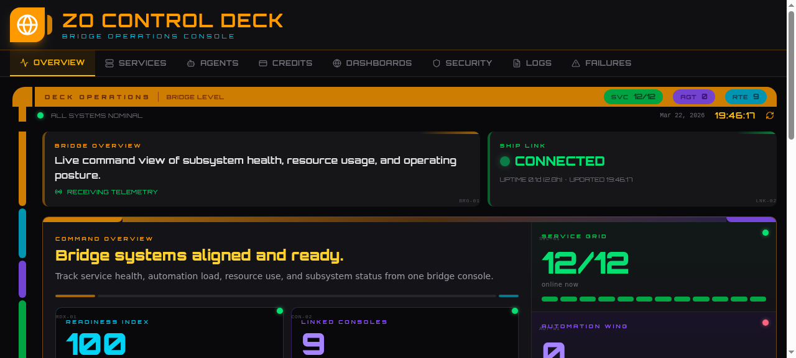

# Zo Control Deck

A multi-tab operations dashboard for [Zo Computer](https://zocomputer.com) with 8 distinct sci-fi themed tabs, each pulling live data from your own environment.

       



## Tabs

| Tab | Theme | Data Source |
|---|---|---|
| **Overview** | Star Trek LCARS bridge | CPU, memory, disk, services, agents, credits |
| **Services** | Star Wars targeting computer | Live process list from your server |
| **Agents** | Alien Nostromo terminal | Scheduled agents and dispatch state |
| **Credits** | Blade Runner neon finance | Credit balance, burn rate, model drain |
| **Dashboards** | TRON Grid access deck | Published routes and space assets |
| **Security** | HAL 9000 observation console | Audit events (requires admin API) |
| **Logs** | Matrix terminal trace | Live log output from supervisord |
| **Failures** | Star Wars Red Alert board | Incident tracking (requires admin API) |

## Install

> **Requires a [Zo Computer](https://zocomputer.com) account with zo.space access.**

### Option 1: Ask Zo to install it

Open a chat with Zo and say:

```
Install the zo-control-deck skill and deploy all routes
```

### Option 2: Manual install via Zo chat

1. Clone this repo into your workspace:
   ```
   cd /home/workspace/Skills
   git clone https://github.com/KaiyzerBX50/zo-control-deck.git
   ```

2. Ask Zo to run the skill:
   ```
   Run the zo-control-deck skill
   ```

   Zo will read `SKILL.md`, find the route files, and deploy them to your space.

### Option 3: Manual route deployment

Copy each file from `routes/` to your zo.space using `update_space_route`:

- `routes/pages/zo-control-deck.tsx` → page at `/zo-control-deck`
- `routes/api/system-stats.ts` → API at `/api/system-stats`
- `routes/api/services.ts` → API at `/api/services`
- `routes/api/agents.ts` → API at `/api/agents`
- `routes/api/credits.ts` → API at `/api/credits`
- `routes/api/sites.ts` → API at `/api/sites`
- `routes/api/audit.ts` → API at `/api/audit`
- `routes/api/billing.ts` → API at `/api/billing`

## Security

- The dashboard page (`/zo-control-deck`) is **private by default** — only you can see it when logged into your Zo Computer.
- All data comes from **your own environment** — no external APIs, no third-party services.
- API routes read from local system files (`/proc/meminfo`, `/proc/loadavg`, process list) and workspace files.
- No secrets or API keys are required.
- No data leaves your server.

## Architecture

- **Runtime**: Zo Space (Bun + Hono server + React + Tailwind CSS 4)
- **Font**: [Orbitron](https://fonts.google.com/specimen/Orbitron) (loaded via Google Fonts CDN)
- **Icons**: lucide-react (pre-installed in zo.space)
- **Data refresh**: Auto-polls every 30 seconds
- **Zero dependencies**: No npm packages to install — uses only what zo.space provides

## Customization

Each tab is a self-contained React function. To customize:

1. Get the route code: ask Zo to `get the code for /zo-control-deck`
2. Edit the specific tab function (e.g., `OverviewTab`, `ServicesTab`)
3. Update the route: ask Zo to apply your changes

### Credits tab manual override

The Credits tab includes a **Ledger Override** feature. Enter a custom balance and click COMMIT UPDATE to recalculate projected runway and reserve units. The override persists in localStorage.

## License

MIT — do whatever you want with it.
